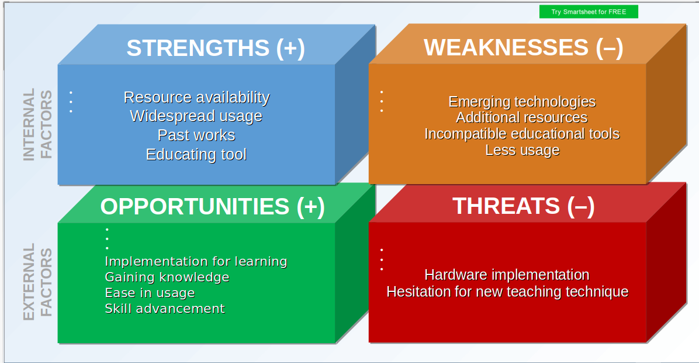

# Requirements

## Introduction
- Learning Digital Logic Circuit was always fun i thought of a making it even more fun by using C programming as an aid.
 - Step into DLC mini project is an application based on Digital Logic Circuit, it consist of the basics such as gates, adder and subtractor.

## Research
### Step into DLC benefits
Step into DLC helps in understanding the outcomes of various gates, adder and subtractor
### Organization
Step into DLC offers fast and better visulization of the various types of logic gates, adder and subtractor. It saves time.
### Benefits 
Step into DLC can be used as an tool to help students in faster learning and  

## Cost and Features
Time : 10 days   
Scope: Future advancement 
Cost : Only during implementation

## Defining the system
This system will consist of the various types of gates, adder and subtractor in functions and the user can choose which one they want to learn and can get benefited.

## Content
- AND gate
- OR gate
- NOT gate 
- NOR gate
- NAND gate
- EXOR gate
- EXNOR gate
- Half adder
- Half subtractor

## SWOT Analysis

  ## 4W and 1H
  What is this mini project about?   
            This mini project helps in learning the basic concepts of Digital Logic Circuit.    
    
 Why is this mini project developed?  
            This mini project helps in better visualization of the basic concepts of DIgital Logic Circuit and can help in faster undersatanding.

Where is this mini project applicable?  
            It can help taeching students during camps, it can be used o refresh befor going to exams.

When will this mini project be ready?  
            April 15, 2021

How will this mini project be developed?  
            Step by step development of each information needed.

## High Level Requirements
| ID   | Description          | Implementation |
| ------------- |:-------------:| -----:|
| HR01      | Basic gates AND,OR,NOT | LR01-LR03 |
| HR01      | Exclusive-OR(EXOR) | LR04 |
| HR01      | Universal gates NAND,NOR| LR05-LR06 |
| HR01      | Exclusive_NOR(EXNOR)| LR07 |
| HR01      | Half adder | LR08|
| HR01      | Half subtractor | LR09 |

## Low Level Requirements
| ID   | Description          | Implementation |
| ------------- |:-------------| -----:|
| LR01    | AND gate performs the multiplication operation between 2 binary digits and the result is given as the output. The defined AND function will refer through the cases and return the ouput.| Implemented |
| LRR02     | OR gate performs the additiontion operation between 2 binary digits and the result is given as the output. The defined OR function will refer through the cases and return the ouput. | Implemented |
| LRR03     | NOT gate performs the negation operation of a binary digit and the result is given as the output. The defined NOT function will refer through the cases and return the ouput. | Implemented |
| LRR04      | EXOR gate performs the odd detector operation between 2 binary digits and the result is given as the output. The defined EXOR function will refer through the cases and return the ouput. | Implemented |
| LRR05    | NAND is an universal gate that performs the negation of AND operation between 2 binary digits and the result is given as the output. The defined NAND function will refer through the cases and return the ouput. | Implemented |
| LRR06      | NOR gate is an universal gate that performs the negation of OR operation between 2 binary digits and the result is given as the output. The defined NOR function will refer through the cases and return the ouput. | Implemented |
| LRR07   | EXNOR gate performs the negation of EXOR operation between 2 binary digits and the result is given as the output. The defined EXNOR function will refer through the cases and return the ouput. | Implemented |
| LRR08    | Half adder performs the addition operation between 2 binary digits and the sum and carry is given as the output. The defined half adder function will refer through the cases and return the sum. | Implemented |
| LRR09      | Full adder performs the additiontion operation between 3 binary digits and sum ,carry is given as the output. | Future |
| LRR010     |Half subtractor performs the subtraction operation between 2 binary digits and the difference and borrow is given as the output. The defined half subtractor function will refer through the cases and return the difference . | Implemented |
| LRR011     | Full subtractor performs the subtraction operation between 3 binary digits and difference,borrow is given as the output. | Future |

    

